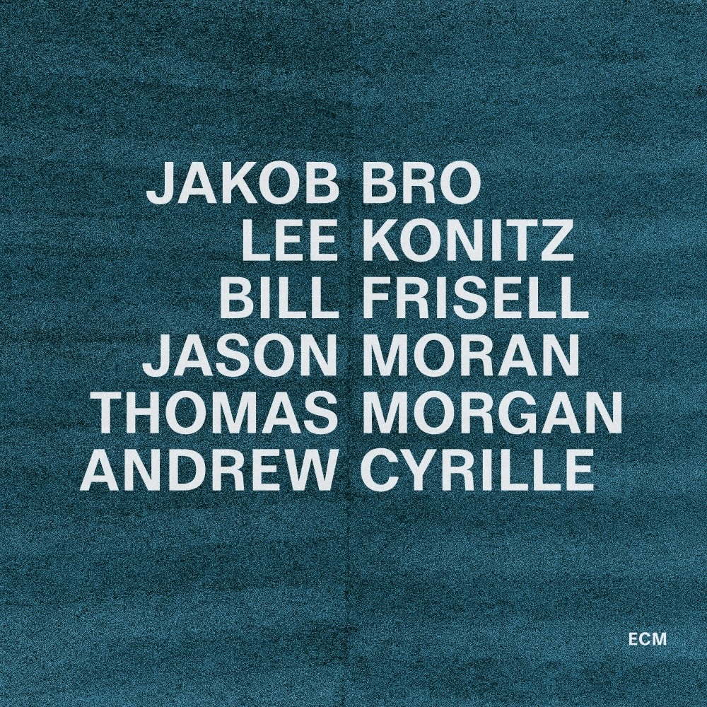

Ambient music is my workday companion. The albums collected here — ranging from spectral drones to late-night meditative jazz to minimalist classical pieces — have a peculiar effect: they help me carve out a space where focus is sustained and time seems to suspend itself. These are the records that have colored my working hours throughout 2024.

#### Rafael Anton Irisarri - Façadisms

#### Endurance (Original Motion Picture Soundtrack)

#### Earthen Sea - Recollection

#### Jakob Bro - Taking Turns

#### Malibu - Palaces of Pity

#### Jon Hopkins - Ritual

#### Alva Noto - Xerrox, Vol. 5

#### Roger Eno - The Skies: Rarities

#### Not Waving & Romance - Wings of Desire

#### Suso Saiz - Distorted Clamor

